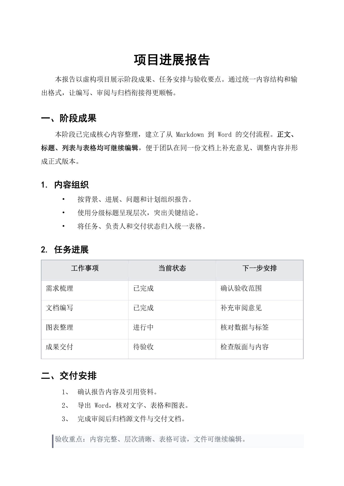
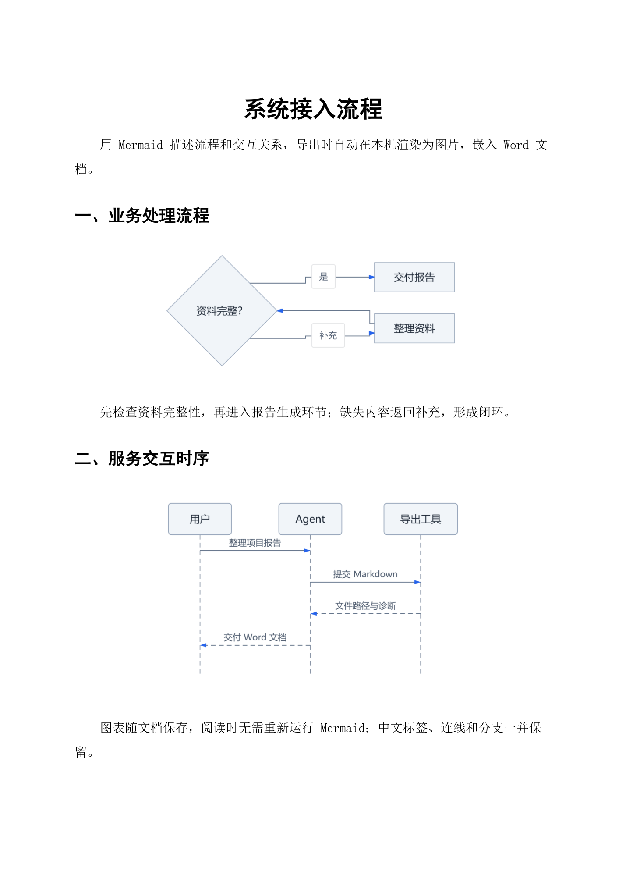
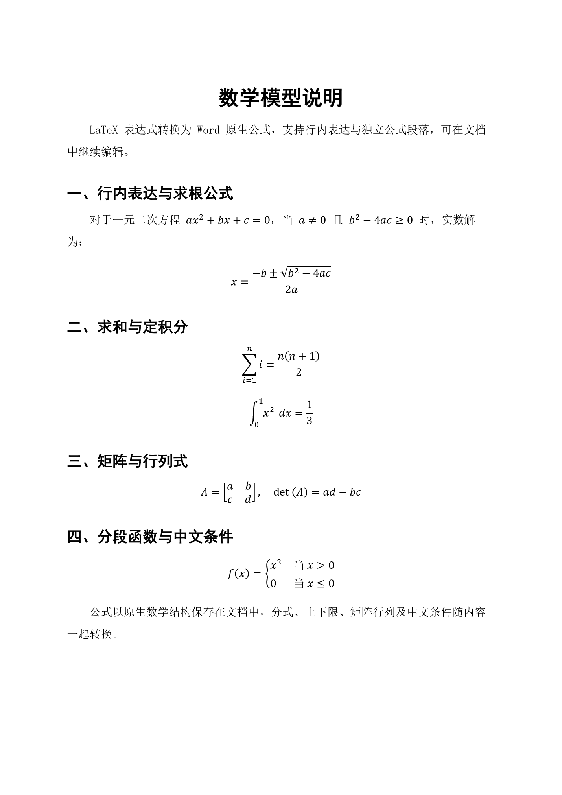

# bruce-md2word

**面向 AI Agent 的 Markdown 转 Word 工具：开箱即用的中文排版、Mermaid 图表转图片、可编辑数学公式。**

让 Agent 写好的报告、方案和技术说明直接成为可交付的 `.docx`：中文内容自动应用预设排版，Mermaid 图表在本机渲染为图片并嵌入，LaTeX 数学公式转换为可继续编辑的 Word 原生公式，减少复制内容后重新排版、截图和录入公式的工作。

提供 **Skill + 独立 CLI**，供具备命令执行能力的 Agent 和自动化脚本调用；同时提供 **DSH 插件**，通过原生 `word_export` 工具导出。npm 包、CLI 和 Skill 均名为 `bruce-md2word`。

## 三个特色功能

- **开箱即用的中文排版**：A4 页面，正文宋体、标题黑体，覆盖六级标题、五级列表及常见文档元素；实际字体显示取决于阅读环境。
- **Mermaid 图表转图片**：将流程图、时序图、状态图、类图、ER 图和 XY 图的常用语法在本机渲染为 PNG，按比例嵌入 Word，支持中文标签，无需手工截图。
- **可编辑的数学公式**：将 LaTeX 行内及块公式转换为 Word 原生公式，支持分式、根式、上下标、向量、求和积分、矩阵和分段函数，方便在 Word 中继续修改。

适合项目报告、实施方案、会议纪要、技术说明等以结构化内容为主的文档。当前提供固定排版样式，不提供自定义 Word 模板接口。

## 导出效果

以下页面均由本项目 CLI 从 Markdown 导出为 DOCX，再使用 **Microsoft Word 原生渲染**截图。点击图片查看大图。

| 开箱即用的中文排版 | Mermaid 图表转图片 | 可编辑的数学公式 |
| :---: | :---: | :---: |
| [](docs/assets/word-chinese.png) | [](docs/assets/word-mermaid.png) | [](docs/assets/word-math.png) |
| [查看 Markdown 源文件](fixtures/showcase/中文排版.md) | [查看 Markdown 源文件](fixtures/showcase/Mermaid图表.md) | [查看 Markdown 源文件](fixtures/showcase/数学公式.md) |

截图使用工具默认样式，未对导出的 Word 进行额外排版。[截图生成方式](docs/assets/README.md)。

## 融入 Agent 的文档交付流程

Agent 可以导出已有 Markdown 文件，也可以直接传入生成的正文。正文、标题、列表和表格保持可编辑；工具返回实际文件位置和结构化警告，方便 Agent 修正缺失图片、不支持的图表或公式后重新导出。严格模式拒绝保存存在内容降级的文档。

安装依赖后，转换在本地完成，无需 Office、Python、浏览器或在线转换服务。默认保存到当前项目的 `output/`，同名文件自动编号。

## 选择安装方式

通用 Agent 选择 Skill + CLI；DSH 用户选择插件。两种方式复用同一转换引擎，无需同时安装。

### 方式一：Skill + CLI

#### 安装 Skill

Skill 名称为 `bruce-md2word`，支持按名称调用的 Agent 可使用该名称选择技能；npm 包名和 CLI 命令也统一为 `bruce-md2word`。

仓库提供独立的 [Skill](skills/bruce-md2word/SKILL.md)，指导具备命令执行能力的 Agent 调用 CLI、处理诊断并交付真实文件路径。它不依赖 DSH 服务，与插件内部调用 `word_export` 的引导说明分别使用。

推荐使用 [skills CLI](https://github.com/vercel-labs/skills) 安装：

```sh
npx skills add bruc3van/bruce-md2word --skill bruce-md2word
```

默认安装到当前项目；添加 `-g` 可安装到用户级目录，添加 `-a <agent>` 可指定目标 Agent。安装后按目标 Agent 的方式重新加载技能。

**安装 Skill 不会自动安装转换 CLI。** 请在 Node.js 24 环境中另行安装：

```sh
npm install -g bruce-md2word@0.3.0
```

也可以直接让 Agent 帮你完成：

> 请检查 Node.js 24，使用 npx skills add bruc3van/bruce-md2word --skill bruce-md2word 安装到当前 Agent 的项目技能目录，并安装 bruce-md2word@0.3.0 CLI。然后将 docs/报告.md 严格导出为 Word，返回真实路径和警告。

需要手动安装时，将源码或 npm 包中的整个 `skills/bruce-md2word/` 目录复制到目标 Agent 的技能目录，保留 `SKILL.md` 和 `references/`。不同 Agent 的技能目录和发现机制以其配置为准；不支持自动发现 Skill 的 Agent，可将其作为项目指令读取。安装器识别成功不代表已逐一验证所有 Agent 的实际调用。

#### 直接使用 CLI

独立 CLI 可用于 DSH 之外的环境。给 Agent 的安装与使用指令：

> 请检查 Node.js 是否为 24，然后安装 bruce-md2word@0.3.0 的独立 CLI，将 docs/报告.md 严格导出为 Word。读取命令返回的 JSON，告诉我真实输出路径和警告；失败时说明错误码和原因。

对应命令：

```sh
npm install -g bruce-md2word@0.3.0
bruce-md2word docs/报告.md --strict -o output/项目报告.docx
bruce-md2word --help
```

CLI 支持文件输入，也支持以 `-` 从标准输入读取 Markdown；正文含相对图片时使用 `--asset-base-dir`。省略 `-o` 时输出到当前目录的 `output/`；显式指定输出目录时，其父目录须已存在。同名文件自动编号，无覆盖选项。

成功时 stdout 输出 JSON；失败时 stderr 输出结构化错误并返回非零退出码，方便 Agent 或脚本判断结果。

### 方式二：DSH 插件

把下面这句话发给 DSH Agent：

> 请帮我安装这个 DSH 插件，并告诉我如何使用：https://github.com/bruc3van/bruce-md2word

安装后重启对应 DSH 服务，即可让 Agent 导出 Word，无需另装 CLI 或 Skill。

<details>
<summary>手动安装命令与环境要求</summary>

当前包要求 Node.js `>=24 <25`、DSH 服务包 `0.1.5-rc.2` 或 `0.1.6-alpha.2`、Cordis `4.0.2`。请在目标 DSH 环境中执行，将 `web` 换成实际 profile，并沿用该环境的 `DSH_HOME`。

```sh
dsh plugin --profile web add bruce-md2word@0.3.0
```

如果你的 DSH 通过 `npx` 启动，可使用对应版本的 CLI，例如：

```sh
npx @deepseek-ai/dsh@0.1.5-rc.2 plugin --profile web add bruce-md2word@0.3.0
```

安装后重启对应 profile。默认项目模式需要 DSH 的 `tools` 与 `shell` 服务就绪，才会注册 `word_export`。版本来源见 [npm 包](https://www.npmjs.com/package/bruce-md2word)，服务依赖见 [运行参考](docs/agent-reference.md#环境与工具注册)。

</details>

## 直接描述你要交付的文档

安装后，Agent 可根据当前入口使用 `bruce-md2word` CLI 或 DSH 的 `word_export`。

### 导出已有 Markdown

> 请将 docs/报告.md 导出为 Word，命名为“项目报告.docx”。使用已安装的 bruce-md2word，开启严格模式；完成后返回实际文件路径，并说明所有警告。

### 从资料生成报告并交付

> 请根据当前项目资料整理一份项目进展报告，包含背景、已完成事项、问题与下一步计划，用表格汇总任务。先保存为 docs/项目进展.md，再使用 bruce-md2word 严格导出为“项目进展报告.docx”。检查导出结果，返回实际路径和需要我关注的问题。

### 在方案中加入图表

> 请编写一份系统接入方案，包含中文 Mermaid 流程图和时序图，保存 Markdown 后使用 bruce-md2word 严格导出 Word。如果返回图中文字过小的提示，请根据对应行号简化标签或拆分图表，再重新导出。

文件保存在**运行 CLI 或 DSH 服务的机器上**。CLI 默认输出到命令工作目录的 `output/`，也可用 `-o` 指定路径；DSH 默认项目模式输出到当前会话项目的 `output/`。已有同名文件时自动追加编号，Agent 应返回实际结果中的真实路径。

## DSH 工具接口与结果处理

DSH 的 `word_export` 一次调用接收一个 Markdown 文件或一段正文，返回可由 Agent 继续处理的结构化结果。文件输入示例：

```json
{
  "source": { "kind": "file", "path": "docs/报告.md" },
  "fileName": "项目报告.docx",
  "strict": true
}
```

工作流程是：**生成或修改 Markdown → 调用导出 → 检查结果与警告 → 修正内容后再次导出 → 交付实际文件**。内容撰写、诊断处理与重试由调用方 Agent 完成，插件负责转换和反馈。

- `strict: true` 遇到缺失图片、不支持的图表等内容降级时拒绝保存；默认值为 `false`。
- 普通模式允许保留替代文字或图表源码，并返回降级警告，适合排查问题。
- `MERMAID_SMALL_TEXT` 是可读性提示，严格模式仍可成功；Agent 应继续检查图表。
- 成功返回文件路径、实际文件名、大小、MIME 类型及 `warnings`。路径来自本地运行环境，不是下载链接。

严格模式通过表示未检测到内容降级，不代表文档事实正确或 Word 排版已验收。完整参数、诊断处理、附件模式与配置见 [Agent 接口与运行参考](docs/agent-reference.md)。

## 能转换哪些内容

| 内容 | 支持范围 |
| --- | --- |
| 正文与标题 | 段落、六级标题、粗体、斜体、删除线、链接 |
| 列表 | 有序与无序列表、五级编号样式、嵌套、指定起点与独立列表重启 |
| 结构化内容 | 表格、引用、行内代码、代码块、分隔线 |
| 图片 | PNG、JPEG、GIF、BMP；支持目录内相对路径和内嵌图片数据 |
| Mermaid | 流程图、状态图、时序图、类图、ER 图、XY 图的常用语法 |
| 数学公式 | LaTeX 行内及块公式转为可编辑 Word 原生公式，覆盖分式、根式、上下标、向量、求和积分、矩阵、分段函数与对齐方程 |

图片相对源 Markdown 所在目录解析；直接传正文时，CLI 使用 `--asset-base-dir`，DSH 使用 `assetBaseDir` 指定相对图片目录。网络图片不会自动下载，SVG 输入不受支持。

Mermaid 使用本地轻量渲染器，不覆盖官方全部语法。饼图、甘特图以及部分配置和指令会触发未渲染警告。中文图表需要生成机器安装中文字体；宽图仍可能缩小到不易阅读，建议拆分。具体范围见 [图表参考](docs/agent-reference.md#mermaid-图表)。

数学公式使用 Temml 在本地解析，通过自有转换层生成 Word 原生公式，无需浏览器、字体图片或外部转换服务。支持 `$...$`、`\(...\)` 行内公式，以及独立块中的 `$$...$$`、`\[...\]`。不支持的结构或错误语法保留完整源码并报告 `MATH_NOT_CONVERTED`，严格模式拒绝保存。自定义宏、公式编号与引用等暂不支持，具体边界见 [公式参考](docs/agent-reference.md#数学公式)。

原始 HTML 按文本保留。脚注和任务复选框等扩展语法不作为原生 Word 功能转换；这些记法可能仅按普通文本输出，未必触发警告。

## 先用样例体验

仓库提供可直接导出的样例，方便检查自己的内容和运行环境：

| 样例 | 用途 |
| --- | --- |
| [综合测试](fixtures/综合测试.md) | 标题、格式、列表、表格、四种图片、六类图表及人工验收清单 |
| [异常降级测试](fixtures/异常降级测试.md) | 缺图、损坏数据、不支持的图表与严格模式失败行为 |
| [完整样式](fixtures/完整样式.md) | 集中查看中文正文、标题和列表排版 |
| [Mermaid 中文](fixtures/Mermaid中文.md) | 检查中文图表、长标签和混排效果 |
| [数学公式](fixtures/数学公式.md) | 检查原生公式、矩阵、中文条件及 Word 编辑效果 |
| [数学公式降级](fixtures/数学公式降级.md) | 检查公式原文保留、行号诊断及严格拒绝行为 |

样例与配套图片位于源码仓库，不包含在 npm 安装包中。使用综合样例时，请保留 `fixtures/assets/` 的相对目录结构。

将仓库放入当前项目后，可以直接告诉 Agent：

> 请使用已安装的 bruce-md2word 严格导出 fixtures/综合测试.md，返回实际文件路径和所有警告。随后对照源文件中的验收清单，说明哪些检查已经完成，哪些需要在 Word 中人工确认。

## 开发与验证

在 Node.js 24 下执行：

```sh
npm ci
npm run typecheck
npm test
npm run test:pack
npm run example
```

从源码导出综合样例：

```sh
npm run build
node lib/cli.js fixtures/综合测试.md --strict -o output/综合测试.docx
```

自动化测试覆盖转换内容、样式 XML、DSH 服务集成、资源限制、取消和独立安装包。Word 的实际分页、字体及视觉效果仍需人工检查，完整 Web/Desktop 交互验收也应单独进行。

[更新日志](CHANGELOG.md) · [自动化检查](https://github.com/bruc3van/bruce-md2word/actions) · [发布流程](docs/releasing.md)

## 许可证

采用 [MIT](LICENSE) 许可证。
