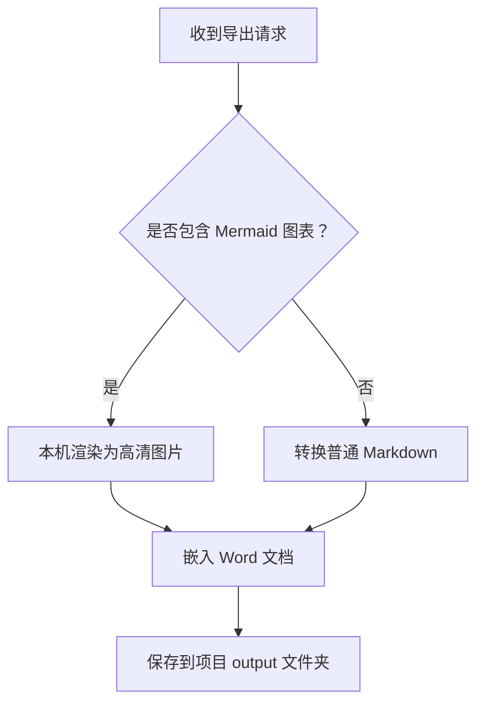
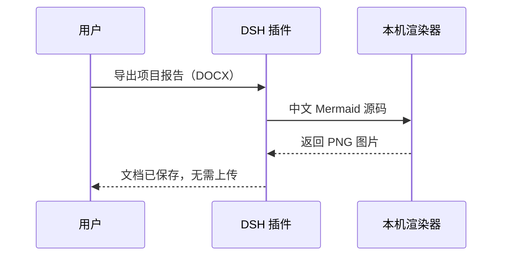
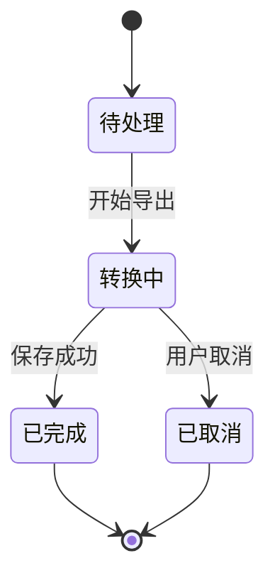
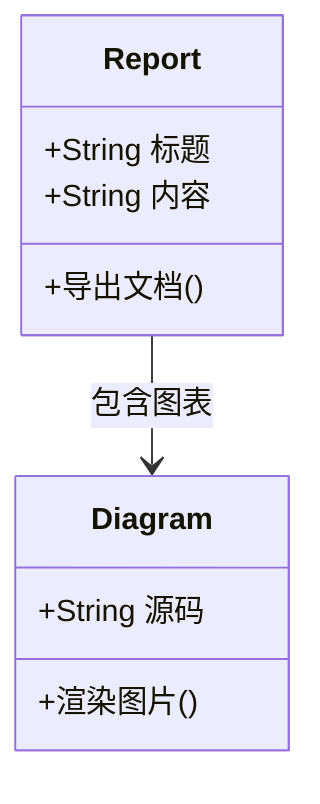
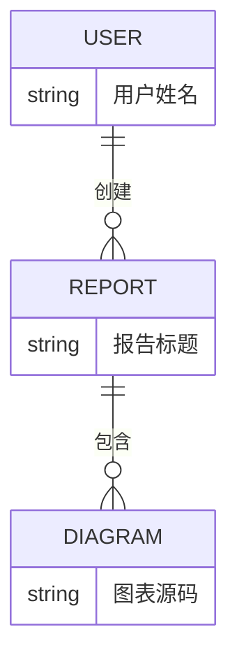

# Mermaid 中文渲染测试

本示例使用本机 Mermaid 渲染器生成 PNG，然后嵌入 Word。涵盖中文、英文混排、分支和换行。

## 中文流程图



## 中文时序图



## 中文长标签与显式换行


## 状态图



## 类图



## 实体关系图



## 中文统计图

```mermaid
xychart-beta
  title "每月文档导出数量"
  x-axis [一月, 二月, 三月, 四月]
  y-axis "文档数量" 0 --> 100
  bar [30, 55, 70, 90]
  line [20, 45, 65, 80]
```
