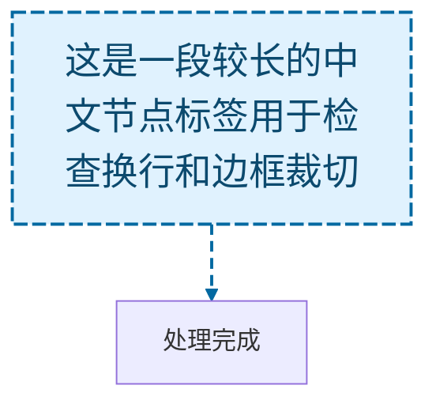
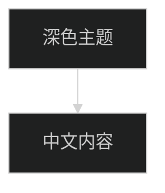

# Mermaid 样式增强

字号、节点虚线和连线虚线：

```mermaid
flowchart TD
  A[这是一段较长的中文节点标签用于检查换行和边框裁切]:::focus --> B[处理完成]
  classDef focus fill:#e0f2fe,stroke:#0369a1,color:#0c4a6e,font-size:24px,stroke-width:2,stroke-dasharray:9\,3
  linkStyle default stroke:#0369a1,stroke-width:2,stroke-dasharray:7 4
```

初始化配置中的颜色：

```mermaid
%%{init: {theme:'base',themeVariables:{primaryColor:'#dcfce7',primaryBorderColor:'#15803d',primaryTextColor:'#14532d',lineColor:'#166534'}}}%%
flowchart LR
  A[开始]-->B[完成]
```

YAML 深色主题和间距：

```mermaid
---
config:
  theme: dark
  flowchart:
    nodeSpacing: 30
    rankSpacing: 40
---
flowchart TD
  A[深色主题] --> B[中文内容]
```
