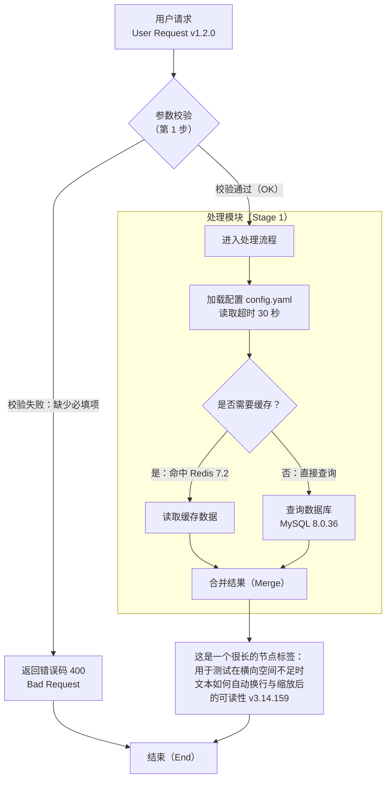
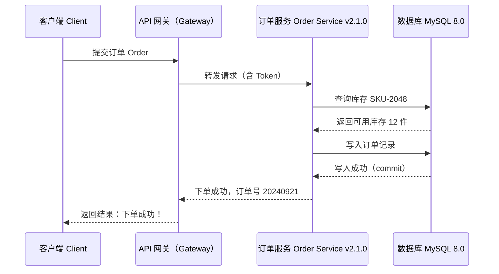
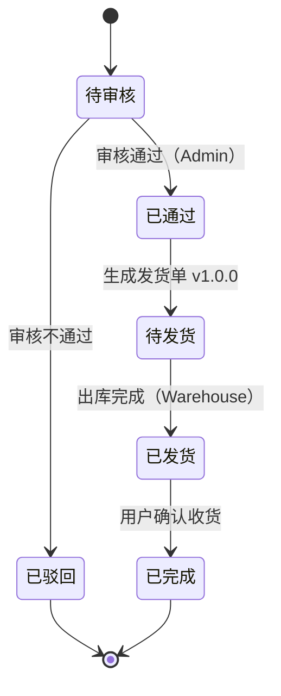
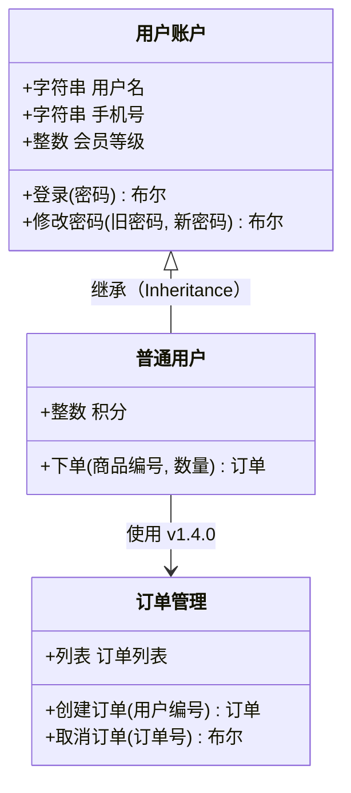
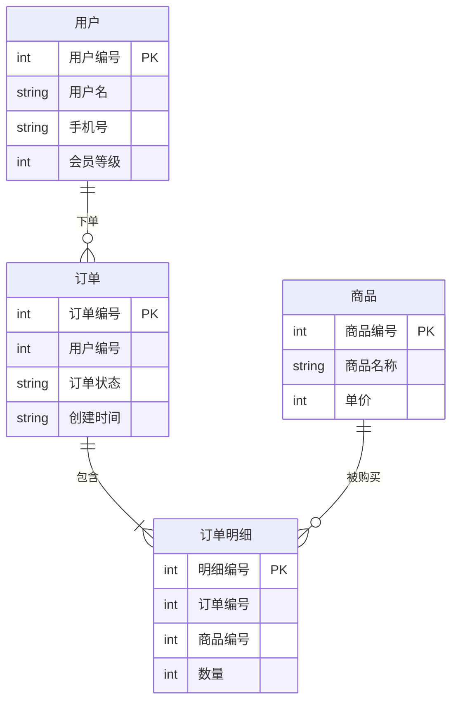
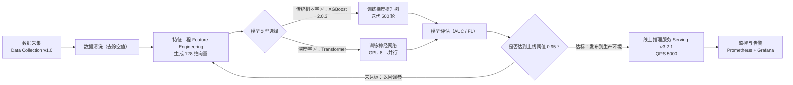

# Mermaid 正常案例测试

本文档用于验证 `dsh-md2word`（word_export）的 Mermaid 转图片能力。共六类图，每张图前给出编号、测试目的与预期效果。

覆盖要点：中文节点与中文连线标签、全角标点、中英数字版本号混排、长标签与 `<br>` 换行、分支汇合与子图、时序图多参与者与返回消息、类图中文属性方法、ER 图中文字段名（无字段注释）、XY 图中文标题与坐标轴、一张较宽的横向流程图，以及普通 Markdown 与图表混排。

---

## 一、流程图（flowchart）

**编号：** M1
**测试目的：** 验证中文节点、中文连线标签、全角标点、中英数字版本号混排、长标签、`<br>` 显式换行、分支、汇合与子图。
**预期效果：** 渲染为 PNG 流程图；节点内出现中文与 `User Request v1.2.0` 等混排文本；带 `<br>` 的标签分成两行；出现判断分支与汇合节点；`处理模块（Stage 1）` 子图边框完整包裹其内部节点。



---

## 二、时序图（sequenceDiagram）

**编号：** M2
**测试目的：** 验证多个参与者、中文参与者别名、请求消息与返回消息（`->>` / `-->>`）、中文消息标签与全角标点。
**预期效果：** 渲染为 PNG 时序图；顶部出现 4 个参与者（客户端、网关、订单服务、数据库）；箭头方向一致；返回消息用虚线箭头表示；消息文本为中文。



---

## 三、状态图（stateDiagram）

**编号：** M3
**测试目的：** 验证状态图的中文状态名、中文转移标签、起始与结束状态、带版本号的转移说明。
**预期效果：** 渲染为 PNG 状态图；出现 `[*]` 起始点与结束点；状态名与转移标签均为中文；`审核通过（Admin）` 等标签显示在箭头上。



---

## 四、类图（classDiagram）

**编号：** M4
**测试目的：** 验证类图中的中文类名、中文属性名、中文方法名与参数、可见性符号与继承关系。
**预期效果：** 渲染为 PNG 类图；`用户账户`、`订单管理` 等类框内出现中文属性与方法签名；`<|--` 继承箭头正确连接；关联关系带中文标签。



---

## 五、ER 图（erDiagram）

**编号：** M5
**测试目的：** 验证 ER 图中的中文实体名、中文字段名、中文关系标签、主键标记；**不使用字段注释**（字段后不加引号注释）。
**预期效果：** 渲染为 PNG ER 图；实体 `用户`、`订单`、`订单明细` 内出现中文字段名与 `int`/`string` 类型；关系连线标签为中文；`PK` 标记出现在主键字段后。



---

## 六、XY 图（xychart-beta）

**编号：** M6
**测试目的：** 验证 XY 图的中文标题、中文坐标轴标签、中文类目、柱状数据与折线数据共存。
**预期效果：** 渲染为 PNG 图表；顶部标题为中文；X 轴为四个季度中文类目；Y 轴带单位标签；同一坐标系内同时出现柱状与折线。

```mermaid
xychart-beta
    title "季度销售额与目标对比（万元）"
    x-axis [第一季度, 第二季度, 第三季度, 第四季度]
    y-axis "销售额（万元）" 0 --> 500
    bar [120, 260, 190, 420]
    line [100, 240, 210, 460]
```

---

## 七、宽横向流程图（可读性观察）

**编号：** M7
**测试目的：** 生成一张较宽的横向图（`flowchart LR`，长链路 + 长标签），用于观察缩放后的可读性。
**预期效果：** 渲染为 PNG 横向长图；节点数较多导致图片偏宽；导出到 Word 后需要放大才能看清较小文字——该可读性结论需人工打开 Word 判定。



---

## 八、普通 Markdown 与图表混排检查

### 8.1 标题层级

上图为三级标题（`###`），本节为二级标题（`##`），应正确映射为 Word 标题样式。

### 8.2 正文段落

这是一段普通正文，包含 **粗体**、*斜体*、`行内代码`、版本号 v1.2.3、英文 English 与中文混排，以及全角标点：（一）、（二）、（三）。正文应与上方图表正常衔接，不出现断页错乱或图片遮挡文字。

### 8.3 表格

| 图编号 | 图类型 | 语法关键字 | 预期结果 |
| --- | --- | --- | --- |
| M1 | 流程图 | `flowchart TD` | 渲染成功 |
| M2 | 时序图 | `sequenceDiagram` | 渲染成功 |
| M3 | 状态图 | `stateDiagram-v2` | 渲染成功 |
| M4 | 类图 | `classDiagram` | 渲染成功 |
| M5 | ER 图 | `erDiagram` | 渲染成功 |
| M6 | XY 图 | `xychart-beta` | 渲染成功 |
| M7 | 宽横向图 | `flowchart LR` | 渲染成功，宽图缩放 |

### 8.4 有序列表

1. 图表应以内嵌 PNG 图片形式出现在 Word 文档中。
2. 图片下方或上方不应残留原始 Mermaid 源码。
3. 图片与正文之间应保留合理间距。

### 8.5 无序列表

- 中文项目符号一：检查全角标点。
- 中文项目符号二：检查 English mixed text。
- 中文项目符号三：检查数字 0123456789。

### 8.6 代码块

```python
def greet(name: str) -> str:
    """返回中文问候语。"""
    return f"你好，{name}！版本 v1.0.0"
```

### 8.7 引用

> 这是一段引用文本（Blockquote），用于检查与图表混排时的缩进与样式。
