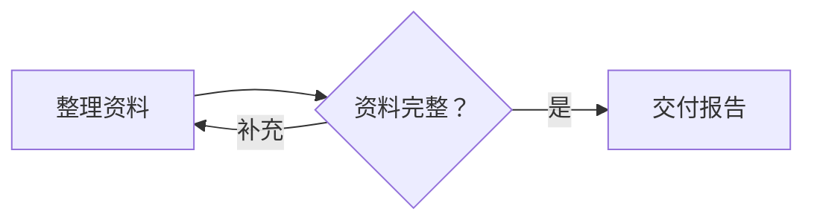
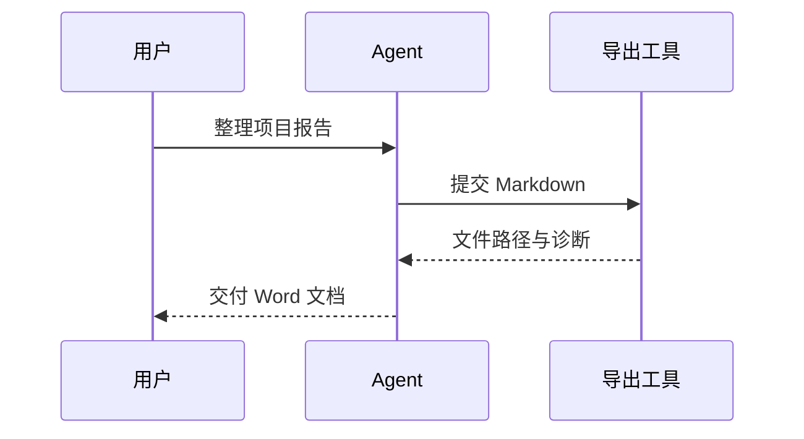

# 系统接入流程

用 Mermaid 描述流程和交互关系，导出时自动在本机渲染为图片，嵌入 Word 文档。

## 一、业务处理流程

```mermaid
flowchart LR
  A[整理资料] --> B{资料完整？}
  B -->|是| C[交付报告]
  B -->|补充| A
```

先检查资料完整性，再进入报告生成环节；缺失内容返回补充，形成闭环。

## 二、服务交互时序

```mermaid
sequenceDiagram
  participant U as 用户
  participant A as Agent
  participant E as 导出工具
  U->>A: 整理项目报告
  A->>E: 提交 Markdown
  E-->>A: 文件路径与诊断
  A-->>U: 交付 Word 文档
```

图表随文档保存，阅读时无需重新运行 Mermaid；中文标签、连线和分支一并保留。
