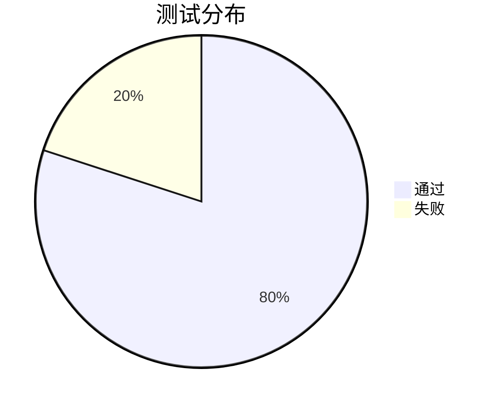
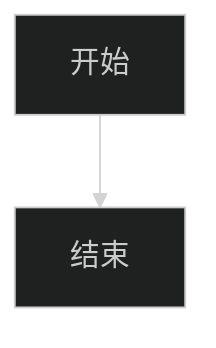

# Markdown → Word 异常降级测试

此文件故意包含不可转换的资源，不能作为零警告样例。与 `综合测试.md` 配套使用。

在项目根目录执行：

```powershell
node lib/cli.js fixtures/异常降级测试.md -o output/异常降级测试.docx
node lib/cli.js fixtures/异常降级测试.md --strict -o output/异常降级测试-strict.docx
```

预期：普通模式保存文档并返回降级警告；图片显示替代文字，未渲染图表保留源码和说明。严格模式以 `CONTENT_INCOMPLETE` 失败，不生成新文件。重复普通导出应追加文件名编号，不覆盖已有文件。

## 1. 不存在的相对图片


## 2. 网络图片


## 3. 不支持的内嵌 SVG 图片


## 4. 损坏的 PNG 数据


## 5. 未支持的饼图



## 6. 未支持的初始化配置



## 7. Mermaid 语法错误

此项用于观察轻量渲染器对不完整语法的容忍行为；当前渲染器可能仍生成图片，不保证每一种官方语法错误都会触发诊断。前两项图表用于验证确定的降级路径。

```mermaid
flowchart TD
  A[未闭合节点
```

## 8. 异常后的普通正文

前面的资源失败不应导致本段在普通模式中丢失。检查诊断能定位图片或图表，且错误消息不泄露整段内嵌数据。

**异常样例文末标记：BRUCE-MD2WORD-DEGRADATION-END**
