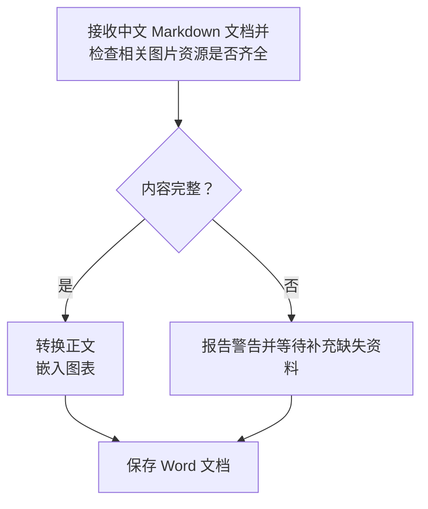
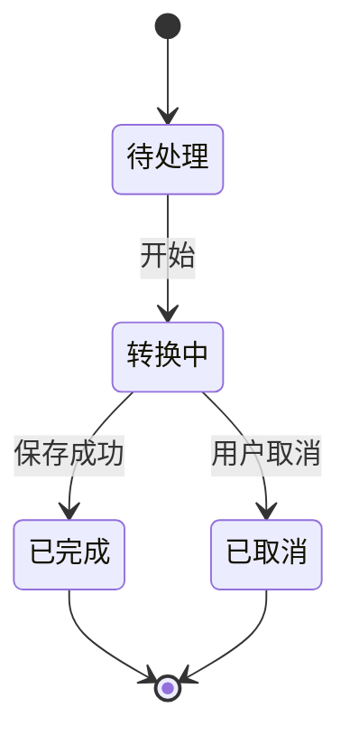
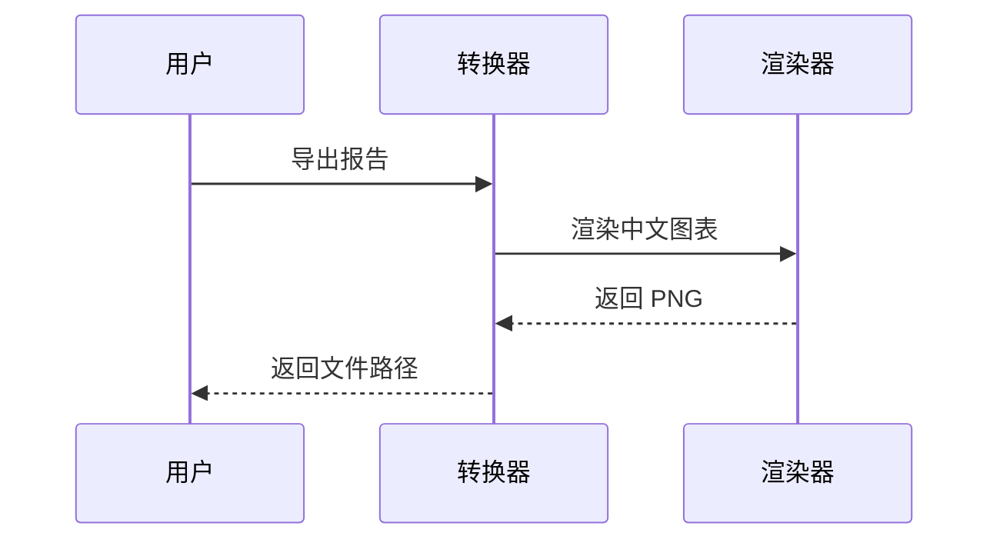
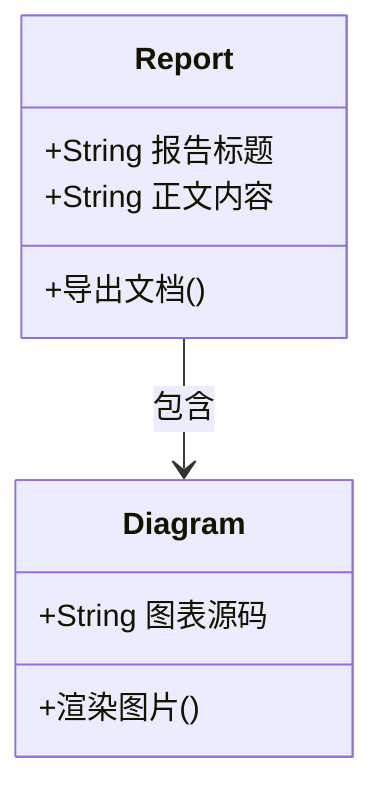
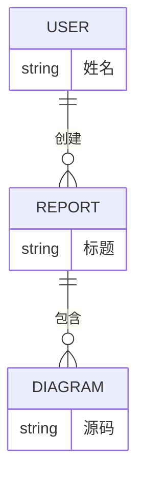

<!-- word:document {"preset":"chinese-report","title":"Markdown → Word 综合测试报告","font":"宋体","headingFont":"黑体","fontSize":12,"lineSpacing":1.5,"firstLineIndent":2,"margins":{"left":28,"right":22},"header":"综合转换验收","footer":"虚构测试资料","toc":true,"tocDepth":3,"pageNumbers":true,"headingNumbering":true} -->

# 使用说明

本文用于 bruce-md2word 的转换与人工排版验收。所有人物、数量和业务内容均为虚构测试数据。图片位于同级 `assets/综合测试/` 目录，复制本文时请一起复制该目录。

本文是综合验收入口，每项核心能力提供代表用例；专项文档负责更完整的语法、边界与异常场景。标题使用 Word 自动编号，Markdown 标题不手写章节号。本文启用中文报告预设并显式配置字体、字号、行距、缩进和左右边距；默认样式与技术预设需通过文末列出的专项样例分别检查。

运行方式（在项目根目录执行，先运行 `npm run build`）：

```powershell
node lib/cli.js fixtures/综合测试.md --strict -o output/综合测试.docx
```

预期：成功生成 Word，内容完整，无降级警告。若出现 `MERMAID_SMALL_TEXT`，应检查对应图中文字；该信息提示不会使严格模式失败。异常路径另见同目录的 `异常降级测试.md`。

打开 Word 后先更新整个目录及全部域，再检查目录跳转、图表引用和页码；前向引用必要时再次更新。目录页计入总页数，分节后页码应连续。导出成功只表示转换检查通过，人工验收表必须在实际阅读器中检查后填写。

## 覆盖清单

| 类别 | 样例内容 | 验收重点 |
| :--- | :--- | :--- |
| 标题 | 一至六级、Setext 标题、标题内格式 | 层级、字体、间距 |
| 正文 | 中英混排、软换行、硬换行、转义、实体 | 不丢字、不出现乱码 |
| 行内格式 | 粗体、斜体、删除线、组合格式、代码 | 格式边界准确 |
| 链接 | 普通、引用式、自动链接、邮件、中文及重复标题跳转 | 目标保留，显示文字完整 |
| 列表 | 五级嵌套、混合、松散、指定起点、重启 | 编号和缩进正确 |
| 引用 | 多段、嵌套、内部列表与代码 | 内容完整、层次可辨 |
| 代码 | 围栏、缩进、空行、特殊字符、长行 | 空格和源码保留 |
| 表格 | 对齐语法、空单元格、转义竖线、长文本、图片 | 列宽明确，无越界 |
| 图片 | PNG、JPEG、GIF、BMP、数据 URI、中文空格路径 | 比例正确、可见、不过宽 |
| 图表 | 流程、状态、时序、类、ER、XY | 六类均生成图片 |
| 数学公式 | 行内、块公式、列表及表格内公式 | 可编辑 Word 公式 |
| 原生脚注 | 多段、重复引用、格式与公式 | 同一脚注不重复创建，内容可编辑 |
| 原样文本 | HTML、任务列表 | 不误认为增强语法已支持 |
| 文档配置 | 字体、边距、目录、页眉页脚、页码、标题编号 | 配置生效，域更新正确 |
| 图表引用 | 自动图题和表题、前向与后向引用 | 图表分别编号，引用可跳转 |
| 分节与编号 | 纵横向切换、显式列宽、命名续号、章节重启 | 方向、列宽与编号符合预期 |
| 连续排版 | 长段落、相邻表格、跨页长表与代码、文末标记 | 分页无丢失、末尾可见 |

## 标题与正文

### 三级标题：**重要内容**与 `Heading3`

三级标题后的正文。中文字体、英文 English、数字 0123456789 应清晰可辨。

#### 四级标题

四级正文：金额 ¥1,234.56，比例 99.95%，温度 36.5°C，日期 2026-09-22。

##### 五级标题

五级正文：全角标点【】《》「」（），半角符号 () [] {} <> &。

###### 六级标题

六级正文：简体中文、繁體中文、English、café、α β γ、箭头 →、勾选 ✓、表情 😀。特殊字符外观取决于阅读环境的字体。

Setext 二级标题
----------------

这一标题使用下划线语法，应成为二级标题。

这是软换行的第一行，
这是同一段落的第二行，检查二者不会被误拆成独立段落。

这是使用两个尾随空格的硬换行。  
这是硬换行后的同一段文字。

这是使用反斜杠的硬换行。\
这是反斜杠换行后的内容。

上面与本段之间有空行，应形成独立段落。以下文本用于检查转义：\*不是斜体\*、\# 不是标题、\[不是链接\]、foo_bar_baz、路径 `C:\项目资料\测试.md`。

实体解码：&amp;、&lt;tag&gt;、&quot;引号&quot;、&#169;；预期依次可见 &、<tag>、"引号"、©。

## 行内格式与链接

普通文本，**粗体**，*斜体*，***粗斜体***，~~删除线~~，**粗体中包含 *斜体* 与 `code`**，以及 ~~删除线中的 **粗体**~~。格式结束后的这句话应恢复正文样式。

行内代码：`a < b && b > 0`、`name_with_underscore`、``包含 `反引号` 的代码``。

普通链接：[示例页面](https://example.com/report?year=2026&mode=test)。带格式的链接：[**加粗链接**](https://example.com/a_(b))。

引用式链接：[转换说明][guide]；再次引用：[同一个目标][guide]。自动链接：<https://example.com>。邮件：<qa@example.com>。

裸地址 https://example.com/plain 用于观察普通文本；本项目未开启自动识别裸地址。

[guide]: https://example.com/guide "测试链接标题"

## 列表、编号与复杂列表项

### 五级无序列表

- 第一级：项目
  - 第二级：模块
    - 第三级：功能
      - 第四级：检查项
        - 第五级：叶子项，含 **重点** 与 `value`
- 返回第一级：不得继承第五级缩进。

### 五级有序列表

1. 第一级
   1. 第二级
      1. 第三级
         1. 第四级
            1. 第五级
2. 返回第一级，编号应为 2。

### 指定起始编号

3. 此列表从 3 开始。
4. 此项编号应为 4。
5. 此项编号应为 5。

这段正文将两个有序列表分开。

1. 新列表应重新从 1 开始。
2. 第二项应为 2。

### 混合与松散列表

1. 接收任务。

   这是第一项的第二段，检查其仍属于当前列表项。

   - 检查标题。
   - 检查正文。
     1. 先检查中文。
     2. 再检查 English。

2. 执行转换。

   ```json
   { "strict": true, "fileName": "测试报告.docx" }
   ```

3. 完成验收，列表应继续编号。

## 引用与分隔线

> 第一段引用：本报告仅用于测试 **文档转换**。
>
> 第二段引用：含 [测试链接](https://example.com) 和 `inline code`。
>
> > 嵌套引用：检查文本保留及层次表现。
>
> - 引用中的列表第一项。
> - 引用中的列表第二项。
>
> ```text
> 引用中的代码：a < b
> ```

引用结束，本段应恢复普通正文。

---

上方为短横线分隔线。

***

上方为星号分隔线。

## 代码与空白保留

```typescript
// 中文注释：检查缩进、空行、引号与尖括号
type Result = { ok: boolean; title: string };

function exportReport(title: string): Result {
  const escaped = "<tag attr='value'>&正文</tag>";
  return { ok: title.length > 0, title: `${title}: ${escaped}` };
}
```

~~~text
使用波浪线围栏，内部可保留三反引号：
```markdown
# 代码中的标题不会变成 Word 标题
```
~~~

    缩进代码第一行
        缩进代码第二行：保留额外四个空格
    缩进代码第三行

```
无语言标记的代码块

中间有一个空行；下面是一条长行，检查 Word 中的换行和页面边界。
abcdefghijklmnopqrstuvwxyz_0123456789_ABCDEFGHIJKLMNOPQRSTUVWXYZ_abcdefghijklmnopqrstuvwxyz_0123456789_ABCDEFGHIJKLMNOPQRSTUVWXYZ
```

## 表格

### 对齐语法、行内格式与空值

| 左对齐语法 | 居中语法 | 右对齐语法 |
| :--- | :---: | ---: |
| 普通中文 | **重点** | 1,234.50 |
| *斜体*与~~删除~~ | `a\|b` | -0.25 |
| [链接](https://example.com) | 转义竖线 a\|b | 100% |
| 空值在右边 |  |  |
|  | 中间有值 | 0 |

检查表头、边框、单元格留白和明确列宽。三列的表头与内容应分别左对齐、居中、右对齐；空单元格保持位置，不能只根据 Markdown 预览判断 Word 效果。

### 长内容与多列表格

| 编号 | 模块 | 负责人 | 状态 | 验收说明 |
| --- | --- | --- | --- | --- |
| T-001 | 输入处理 | 测试甲 | 已完成 | 中文与 English 混排，检查长文本是否在单元格内部自然换行。 |
| T-002 | 文档排版 | 测试乙 | 待检查 | 连续中文长文本用于确认不会挤出页面边界也不会遮挡相邻列中的文字内容。 |
| T-003 | 图片处理 | 测试丙 | 已完成 | PNG / JPEG / GIF / BMP，注意保持宽高比例。 |
| T-004 | 图表处理 | 测试丁 | 待检查 | Mermaid 图表应可读；宽图缩放后的文字需要人工确认。 |
| T-005 | 输出校验 | 测试戊 | 已完成 | 文末标记、媒体资源、链接目标均需要保留。 |

### 单列表格

| 只有一列 |
| --- |
| 第一行 |
| 第二行：**加粗**与 `code` |

## 图片与路径

以下几何色块为程序生成的测试素材。横图比例为 3:1，竖图比例为 1:2；用于观察缩放、色彩与表格内图片宽度。

### PNG：中文及空格文件名


图后正文应独立出现，不应被图片遮挡。

### JPEG 与 GIF


GIF 使用静态素材验证格式读取；动画只取首帧的行为应由专门测试验证。

### BMP 与竖图


### 表格中的图片

| 场景 | 图片 | 说明 |
| --- | --- | --- |
| 横图 |  | 图片应限制在单元格列宽内。 |
| 竖图 |  | 检查比例及行高。 |

### 内嵌数据图片

下方是一个 1×1 像素的 PNG，只用于验证数据 URI 内嵌路径，不用于视觉验收。


## Mermaid 六类图表

### 流程图：分支、中文长标签与显式换行



### 状态图



### 时序图



### 类图



### ER 图



### XY 图

```mermaid
xychart-beta
  title "文档转换测试数量"
  x-axis [一月, 二月, 三月, 四月]
  y-axis "数量" 0 --> 100
  bar [30, 55, 70, 90]
  line [20, 45, 65, 80]
```

## 原样文本与扩展语法边界

以下内容不应作为已支持的增强功能验收；主要检查文字是否保留。某些未启用的 Markdown 扩展语法作为普通文本输出，不一定产生警告。

原始 HTML：<span style="color:red">这段标签应作为文本保留</span>。<br> 不应在此被当成 HTML 换行标签。

- [ ] 未完成任务：检查方括号文本，不要求交互复选框。
- [x] 已完成任务：不要求 Word 内容控件。

## 连续正文与分页检查

第一段：本次验收以内容完整性为基础，逐项检查标题层级、文字格式、列表编号、表格边界和媒体显示。文档从 Markdown 转换为 Word 后，应能够继续编辑普通正文；图表以图片嵌入，因此图中文字无需依赖接收端的原始渲染字体。验收人员应在实际使用的 Word 环境打开文件，检查分页、图片清晰度与标题附近的留白。

第二段：当一个段落同时包含中文、English、数字 1234567890、金额 ¥987,654.32 和标点时，应保持语义完整。不能仅依据导出命令成功就认定排版验收通过，还应对照源文件检查内容顺序，确认代码块中的特殊字符、表格中的空值和长内容，以及引用块中的列表没有遗漏。这里的长段落用于观察自然换行和段间距。

第三段：页数会随字体、阅读软件和图表实际尺寸变化，本样例不固定要求页数。检查跨页处的段落是否连续、标题是否孤立在页尾、表格是否超出页面、图表缩放后是否仍清晰。完成检查后，应记录阅读软件和主要排版问题，便于区分转换内容问题与阅读环境差异。

## 公式与原生脚注

行内公式 $E = mc^2$ 和 \(x^2 + y^2\) 应保持在正文行内，以下块公式应独立显示，并均可用 Word 公式编辑器修改。

$$
\frac{1}{n}\sum_{i=1}^{n} x_i = \sqrt{a^2+b^2}
$$

1. 列表内公式：$\frac{a}{b}$，编号和公式均完整。
2. 公式后的列表项应正常续号。

| 名称 | 公式 | 说明 |
| --- | --- | --- |
| 二次式 | $x^2 + 2x + 1$ | 公式仍位于当前单元格内。 |
| 分式 | $\frac{a+b}{c}$ | 应为原生分式，不是图片或源码。 |

首处脚注[^sample]与重复引用[^sample]应指向同一条脚注，另一条脚注[^second]使用不同编号。重复引用更新域后应保持一致。

[^sample]: 这条 **原生脚注**含 *斜体*、[外部链接](https://example.com/note) 和公式 $x^2$。

    这是同一条脚注的第二段，应保留段落边界，不能混入正文。

[^second]: 第二条独立脚注，用于区分重复引用与新增脚注。

## 内部跳转与自动题注

前向引用：见[图号](#ref:overview-image)和[表号](#ref:overview-table)。内部链接分别跳到[中文标题](#中文跳转目标)、[第一次同名标题](#重复跳转目标)和[第二次同名标题](#重复跳转目标-1)。

### 中文跳转目标

中文标题目标正文：ANCHOR-CN。自动标题编号不应改变链接目标。

### 重复跳转目标

第一次同名标题目标：ANCHOR-FIRST。

### 重复跳转目标

第二次同名标题目标：ANCHOR-SECOND。与第一次同名标题的跳转位置应不同。

<!-- word:caption kind=figure id=overview-image -->

综合验收色块图


下面单独检查表题，表序号与图序号互不影响。

<!-- word:caption kind=table id=overview-table -->

综合验收结果表

| 编号 | 结果 |
| --- | --- |
| REF-01 | 图表分别从 1 编号。 |

后向引用：见[图号](#ref:overview-image)和[表号](#ref:overview-table)。更新域后前后引用应分别显示“图 1”和“表 1”，点击可跳转到对应题注。图题与图片、表题与表格应保持相邻，空间允许时同页。

## 容器组合与连续表格

1. 列表项中的图片、表格和续段应与本项内容对齐，并限制在列表可用宽度内。

   

   | 项目 | 说明 |
   | --- | --- |
   | 容器宽度 | 长说明应在列表内部换行，不越过页面右边界。 |

   这是同一项的续段，应保留列表缩进。

2. 返回列表第二项，编号应为 2。

下面两张表只用空行分隔；导出后应保持为两个独立表格，并留有间隔。

| 第一张表 | 数值 |
| --- | --- |
| TABLE-A | 10 |

| 第二张表 | 数值 |
| --- | --- |
| TABLE-B | 20 |

## 显式续号与章节重启

<!-- word:list id=comprehensive-steps restart -->

3. 命名列表从 3 开始。
4. 这一项为 4。

插入普通说明后继续同一命名列表。

<!-- word:list id=comprehensive-steps continue -->

1. 这一项应显示为 5。
2. 这一项应显示为 6。

<!-- word:list id=comprehensive-steps restart -->

1. 显式重启后应为 1。

<!-- word:numbering section=3 -->

### 编号作用域甲

1. 本节第一项为 1。

插入说明后，后续顶层列表自动续号。

1. 本节第二项应为 2。

#### 更低级标题不重置编号

1. 本节第三项应为 3。

### 编号作用域乙

1. 新三级标题后重新从 1 开始。

<!-- word:numbering source -->

恢复源列表策略后，以下两个独立列表均从 1 开始。

1. 独立列表甲。

中间说明。

1. 独立列表乙。

<!-- word:section landscape -->

## 横向页面与显式列宽

本节应新起 A4 横向页，页眉页脚保持，页码连续。

<!-- word:table widths=1,1,4 -->

| 编号 | 状态 | 说明 |
| --- | :---: | --- |
| W-01 | 待验收 | 三列宽度应为 1:1:4，总宽度适应横向页面的可用宽度。 |
| W-02 | 待验收 | 左边距 28mm，右边距 22mm；说明列应显著宽于前两列。 |

<!-- word:section portrait -->

## 恢复纵向页面

本节应新起 A4 纵向页，页码接续横向节；目录页码更新后应对应实际页面。正文首行缩进两个字符，正文宋体 12pt、1.5 倍行距，标题黑体。再次引用[图号](#ref:overview-image)，确认引用跨节仍有效。

## 跨页内容验收

以下长表与长代码用于实际跨页检查；不固定页数。长表跨页后重复表头，短行尽量不拆开，各编号出现一次且顺序连续。长代码允许跨页，不应整块挤到新页形成大面积空白，首尾标记均须保留。

| 行号 | 状态 | 跨页检查说明 |
| --- | --- | --- |
| P-01 | 待核验 | 本行用于跨页验收：检查重复表头、行号连续、中文完整以及短行不拆分，不能遮挡相邻单元格。 |
| P-02 | 待核验 | 本行用于跨页验收：检查重复表头、行号连续、中文完整以及短行不拆分，不能遮挡相邻单元格。 |
| P-03 | 待核验 | 本行用于跨页验收：检查重复表头、行号连续、中文完整以及短行不拆分，不能遮挡相邻单元格。 |
| P-04 | 待核验 | 本行用于跨页验收：检查重复表头、行号连续、中文完整以及短行不拆分，不能遮挡相邻单元格。 |
| P-05 | 待核验 | 本行用于跨页验收：检查重复表头、行号连续、中文完整以及短行不拆分，不能遮挡相邻单元格。 |
| P-06 | 待核验 | 本行用于跨页验收：检查重复表头、行号连续、中文完整以及短行不拆分，不能遮挡相邻单元格。 |
| P-07 | 待核验 | 本行用于跨页验收：检查重复表头、行号连续、中文完整以及短行不拆分，不能遮挡相邻单元格。 |
| P-08 | 待核验 | 本行用于跨页验收：检查重复表头、行号连续、中文完整以及短行不拆分，不能遮挡相邻单元格。 |
| P-09 | 待核验 | 本行用于跨页验收：检查重复表头、行号连续、中文完整以及短行不拆分，不能遮挡相邻单元格。 |
| P-10 | 待核验 | 本行用于跨页验收：检查重复表头、行号连续、中文完整以及短行不拆分，不能遮挡相邻单元格。 |
| P-11 | 待核验 | 本行用于跨页验收：检查重复表头、行号连续、中文完整以及短行不拆分，不能遮挡相邻单元格。 |
| P-12 | 待核验 | 本行用于跨页验收：检查重复表头、行号连续、中文完整以及短行不拆分，不能遮挡相邻单元格。 |
| P-13 | 待核验 | 本行用于跨页验收：检查重复表头、行号连续、中文完整以及短行不拆分，不能遮挡相邻单元格。 |
| P-14 | 待核验 | 本行用于跨页验收：检查重复表头、行号连续、中文完整以及短行不拆分，不能遮挡相邻单元格。 |
| P-15 | 待核验 | 本行用于跨页验收：检查重复表头、行号连续、中文完整以及短行不拆分，不能遮挡相邻单元格。 |
| P-16 | 待核验 | 本行用于跨页验收：检查重复表头、行号连续、中文完整以及短行不拆分，不能遮挡相邻单元格。 |
| P-17 | 待核验 | 本行用于跨页验收：检查重复表头、行号连续、中文完整以及短行不拆分，不能遮挡相邻单元格。 |
| P-18 | 待核验 | 本行用于跨页验收：检查重复表头、行号连续、中文完整以及短行不拆分，不能遮挡相邻单元格。 |
| P-19 | 待核验 | 本行用于跨页验收：检查重复表头、行号连续、中文完整以及短行不拆分，不能遮挡相邻单元格。 |
| P-20 | 待核验 | 本行用于跨页验收：检查重复表头、行号连续、中文完整以及短行不拆分，不能遮挡相邻单元格。 |
| P-21 | 待核验 | 本行用于跨页验收：检查重复表头、行号连续、中文完整以及短行不拆分，不能遮挡相邻单元格。 |
| P-22 | 待核验 | 本行用于跨页验收：检查重复表头、行号连续、中文完整以及短行不拆分，不能遮挡相邻单元格。 |
| P-23 | 待核验 | 本行用于跨页验收：检查重复表头、行号连续、中文完整以及短行不拆分，不能遮挡相邻单元格。 |
| P-24 | 待核验 | 本行用于跨页验收：检查重复表头、行号连续、中文完整以及短行不拆分，不能遮挡相邻单元格。 |
| P-25 | 待核验 | 本行用于跨页验收：检查重复表头、行号连续、中文完整以及短行不拆分，不能遮挡相邻单元格。 |
| P-26 | 待核验 | 本行用于跨页验收：检查重复表头、行号连续、中文完整以及短行不拆分，不能遮挡相邻单元格。 |
| P-27 | 待核验 | 本行用于跨页验收：检查重复表头、行号连续、中文完整以及短行不拆分，不能遮挡相邻单元格。 |
| P-28 | 待核验 | 本行用于跨页验收：检查重复表头、行号连续、中文完整以及短行不拆分，不能遮挡相邻单元格。 |
| P-29 | 待核验 | 本行用于跨页验收：检查重复表头、行号连续、中文完整以及短行不拆分，不能遮挡相邻单元格。 |
| P-30 | 待核验 | 本行用于跨页验收：检查重复表头、行号连续、中文完整以及短行不拆分，不能遮挡相邻单元格。 |
| P-31 | 待核验 | 本行用于跨页验收：检查重复表头、行号连续、中文完整以及短行不拆分，不能遮挡相邻单元格。 |
| P-32 | 待核验 | 本行用于跨页验收：检查重复表头、行号连续、中文完整以及短行不拆分，不能遮挡相邻单元格。 |
| P-33 | 待核验 | 本行用于跨页验收：检查重复表头、行号连续、中文完整以及短行不拆分，不能遮挡相邻单元格。 |
| P-34 | 待核验 | 本行用于跨页验收：检查重复表头、行号连续、中文完整以及短行不拆分，不能遮挡相邻单元格。 |
| P-35 | 待核验 | 本行用于跨页验收：检查重复表头、行号连续、中文完整以及短行不拆分，不能遮挡相邻单元格。 |
| P-36 | 待核验 | 本行用于跨页验收：检查重复表头、行号连续、中文完整以及短行不拆分，不能遮挡相邻单元格。 |

```text
LONG-CODE-BEGIN
LINE-01  中文与 English：保持行序、空格和内容完整。
LINE-02  中文与 English：保持行序、空格和内容完整。
LINE-03  中文与 English：保持行序、空格和内容完整。
LINE-04  中文与 English：保持行序、空格和内容完整。
LINE-05  中文与 English：保持行序、空格和内容完整。
LINE-06  中文与 English：保持行序、空格和内容完整。
LINE-07  中文与 English：保持行序、空格和内容完整。
LINE-08  中文与 English：保持行序、空格和内容完整。
LINE-09  中文与 English：保持行序、空格和内容完整。
LINE-10  中文与 English：保持行序、空格和内容完整。
LINE-11  中文与 English：保持行序、空格和内容完整。
LINE-12  中文与 English：保持行序、空格和内容完整。
LINE-13  中文与 English：保持行序、空格和内容完整。
LINE-14  中文与 English：保持行序、空格和内容完整。
LINE-15  中文与 English：保持行序、空格和内容完整。
LINE-16  中文与 English：保持行序、空格和内容完整。
LINE-17  中文与 English：保持行序、空格和内容完整。
LINE-18  中文与 English：保持行序、空格和内容完整。
LINE-19  中文与 English：保持行序、空格和内容完整。
LINE-20  中文与 English：保持行序、空格和内容完整。
LINE-21  中文与 English：保持行序、空格和内容完整。
LINE-22  中文与 English：保持行序、空格和内容完整。
LINE-23  中文与 English：保持行序、空格和内容完整。
LINE-24  中文与 English：保持行序、空格和内容完整。
LINE-25  中文与 English：保持行序、空格和内容完整。
LINE-26  中文与 English：保持行序、空格和内容完整。
LINE-27  中文与 English：保持行序、空格和内容完整。
LINE-28  中文与 English：保持行序、空格和内容完整。
LINE-29  中文与 English：保持行序、空格和内容完整。
LINE-30  中文与 English：保持行序、空格和内容完整。
LINE-31  中文与 English：保持行序、空格和内容完整。
LINE-32  中文与 English：保持行序、空格和内容完整。
LINE-33  中文与 English：保持行序、空格和内容完整。
LINE-34  中文与 English：保持行序、空格和内容完整。
LINE-35  中文与 English：保持行序、空格和内容完整。
LINE-36  中文与 English：保持行序、空格和内容完整。
LINE-37  中文与 English：保持行序、空格和内容完整。
LINE-38  中文与 English：保持行序、空格和内容完整。
LINE-39  中文与 English：保持行序、空格和内容完整。
LINE-40  中文与 English：保持行序、空格和内容完整。
LINE-41  中文与 English：保持行序、空格和内容完整。
LINE-42  中文与 English：保持行序、空格和内容完整。
LINE-43  中文与 English：保持行序、空格和内容完整。
LINE-44  中文与 English：保持行序、空格和内容完整。
LINE-45  中文与 English：保持行序、空格和内容完整。
LINE-46  中文与 English：保持行序、空格和内容完整。
LINE-47  中文与 English：保持行序、空格和内容完整。
LINE-48  中文与 English：保持行序、空格和内容完整。
LINE-49  中文与 English：保持行序、空格和内容完整。
LINE-50  中文与 English：保持行序、空格和内容完整。
LINE-51  中文与 English：保持行序、空格和内容完整。
LINE-52  中文与 English：保持行序、空格和内容完整。
LINE-53  中文与 English：保持行序、空格和内容完整。
LINE-54  中文与 English：保持行序、空格和内容完整。
LINE-55  中文与 English：保持行序、空格和内容完整。
LINE-56  中文与 English：保持行序、空格和内容完整。
LINE-57  中文与 English：保持行序、空格和内容完整。
LINE-58  中文与 English：保持行序、空格和内容完整。
LINE-59  中文与 English：保持行序、空格和内容完整。
LINE-60  中文与 English：保持行序、空格和内容完整。
LONG-CODE-END
```

## 专项验收入口

以下文件均在本文件同目录，可将运行命令中的输入文件替换为对应名称。此处以文件名列出，避免导出后的文档依赖本地 Markdown 文件跳转。

| 专项文件 | 负责的覆盖范围 |
| --- | --- |
| `完整样式.md` | 默认样式的各类文档元素。 |
| `数学公式.md` | 矩阵、分段函数、积分、对齐方程等完整公式用例。 |
| `分页编号与脚注.md` | 分页、列表策略及脚注专项。 |
| `长文档排版验收.md` | 长表、超长单元格、长代码及自动编号。 |
| `技术文档排版验收.md` | 技术预设与配置覆盖。 |
| `横向正文与纵向目录.md` | 正文初始横向、前置目录纵向的分节边界。 |
| `Mermaid中文.md`、`mermaid-layout.md` | 中文图表及复杂图表布局。 |
| `异常降级测试.md`、`数学公式降级.md` | 降级诊断与严格模式拒绝输出，不能按成功样例验收。 |

## 人工验收记录

转换版本：________；阅读器及版本：________；操作系统：________；验收日期：________。

已更新整个目录及全部域：是／否；实际页数：________。失败项请记录源用例、实际页码、预期与实际差异；未检查的项目保留“待填写”。

| 检查项 | 结果（通过／失败） | 备注 |
| --- | --- | --- |
| 六级标题及各段文字完整 | 待填写 | |
| 五级列表、起点 3、独立列表重启 | 待填写 | |
| 引用、代码空白和格式边界 | 待填写 | |
| 表格长文本、空值及图片无越界 | 待填写 | |
| 四种图片格式与数据 URI | 待填写 | |
| 六类 Mermaid 图片及中文可读性 | 待填写 | |
| 字体、字号、行距、首行缩进和边距生效 | 待填写 | |
| 目录更新、标题自动编号、页眉页脚和页码正确 | 待填写 | |
| 中文及两个同名标题分别跳转到正确位置 | 待填写 | |
| 图表题注分别编号，前后及跨节引用正确 | 待填写 | |
| 行内、块及容器内公式可编辑 | 待填写 | |
| 两条原生脚注、多段内容及重复引用正确 | 待填写 | |
| 列表内图片和表格不越界，相邻表格独立 | 待填写 | |
| 命名列表续号 5、6，章节策略续号与重启正确 | 待填写 | |
| 纵横向切换、1:1:4 列宽及连续页码正确 | 待填写 | |
| 长表重复表头、行号完整，长代码首尾与中间行完整 | 待填写 | |
| HTML 等原样文本没有丢失 | 待填写 | |
| 分页合理且文末标记可见 | 待填写 | |

本 Markdown 不覆盖文件编码错误、路径符号链接、资源预算、超时取消、并发、插件卸载及附件交付，这些需要独立输入或运行环境，由项目自动化测试另行验证。

---

**文末完整性标记：BRUCE-MD2WORD-SAMPLE-END-20260922**
