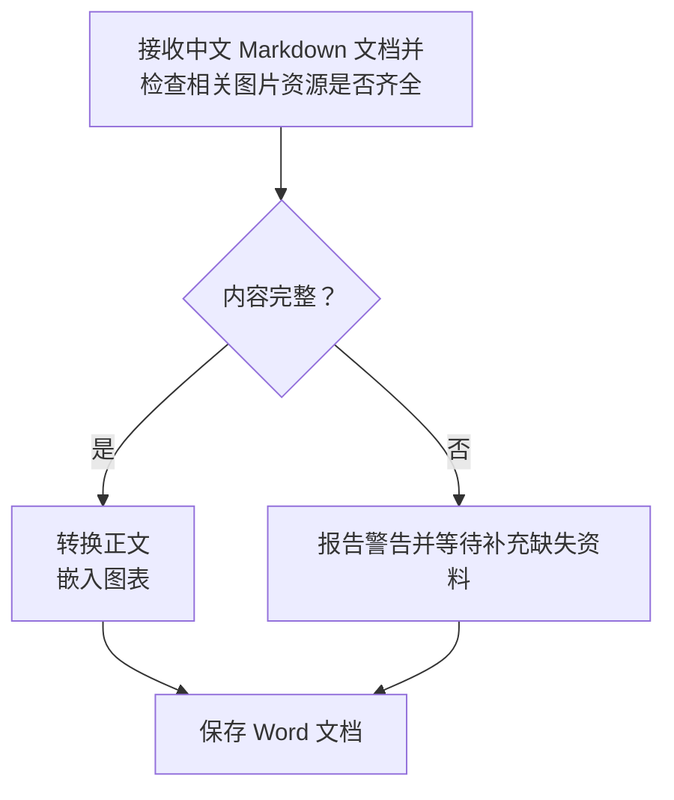
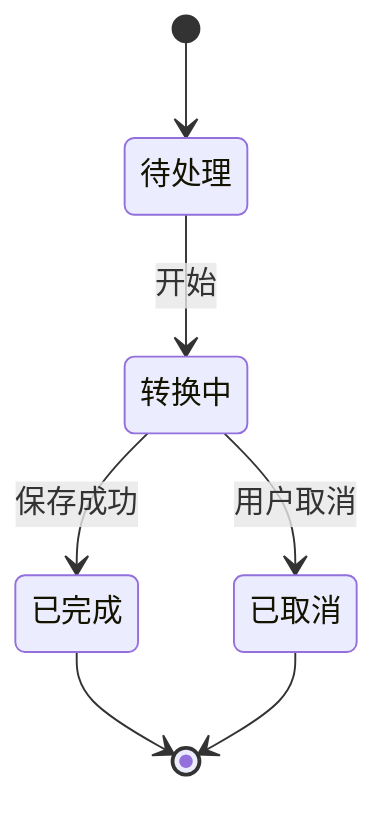
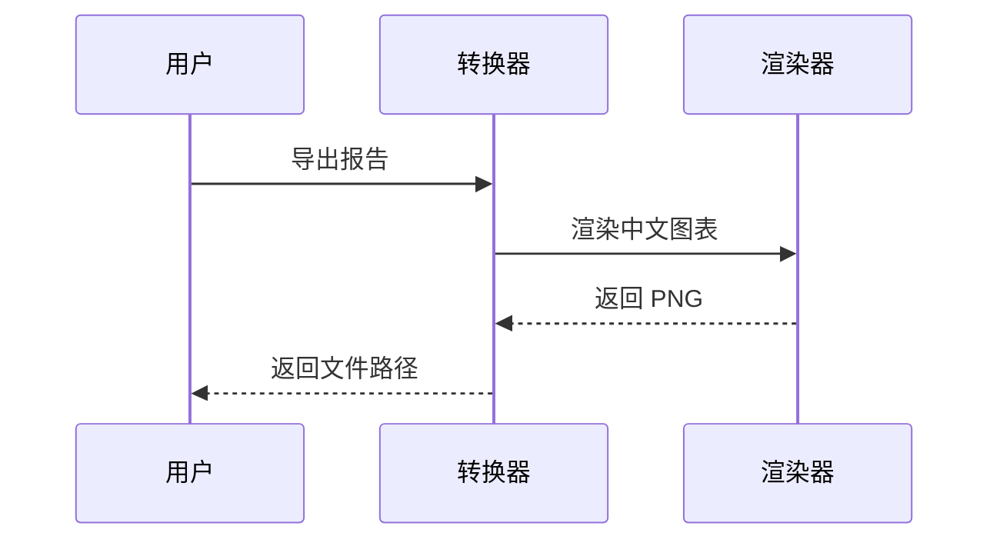
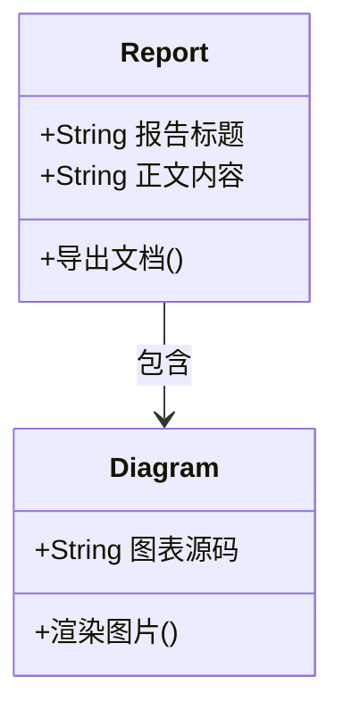
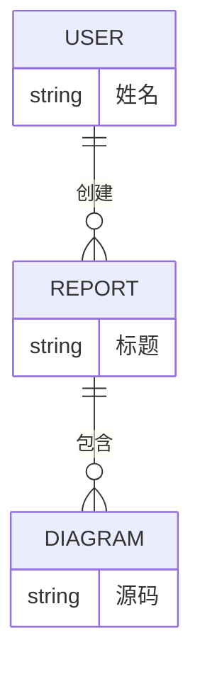

# Markdown → Word 综合测试报告

本文用于 bruce-md2word 的转换与人工排版验收。所有人物、数量和业务内容均为虚构测试数据。图片位于同级 `assets/综合测试/` 目录，复制本文时请一起复制该目录。

运行方式（在项目根目录执行，先运行 `npm run build`）：

```powershell
node lib/cli.js fixtures/综合测试.md --strict -o output/综合测试.docx
```

预期：成功生成 Word，内容完整，无降级警告。若出现 `MERMAID_SMALL_TEXT`，应检查对应图中文字；该信息提示不会使严格模式失败。异常路径另见同目录的 `异常降级测试.md`。

## 1. 覆盖清单

| 类别 | 样例内容 | 验收重点 |
| :--- | :--- | :--- |
| 标题 | 一至六级、Setext 标题、标题内格式 | 层级、字体、间距 |
| 正文 | 中英混排、软换行、硬换行、转义、实体 | 不丢字、不出现乱码 |
| 行内格式 | 粗体、斜体、删除线、组合格式、代码 | 格式边界准确 |
| 链接 | 普通、引用式、自动链接、邮件 | 目标保留，显示文字完整 |
| 列表 | 五级嵌套、混合、松散、指定起点、重启 | 编号和缩进正确 |
| 引用 | 多段、嵌套、内部列表与代码 | 内容完整、层次可辨 |
| 代码 | 围栏、缩进、空行、特殊字符、长行 | 空格和源码保留 |
| 表格 | 对齐语法、空单元格、转义竖线、长文本、图片 | 列宽明确，无越界 |
| 图片 | PNG、JPEG、GIF、BMP、数据 URI、中文空格路径 | 比例正确、可见、不过宽 |
| 图表 | 流程、状态、时序、类、ER、XY | 六类均生成图片 |
| 数学公式 | 行内公式与专项样例入口 | 可编辑 Word 公式 |
| 原样文本 | HTML、任务列表与脚注记法 | 不误认为增强语法已支持 |
| 连续排版 | 长段落、连续表格、分隔线、文末标记 | 分页无丢失、末尾可见 |

## 2. 标题与正文

### 2.1 三级标题：**重要内容**与 `Heading3`

三级标题后的正文。中文字体、英文 English、数字 0123456789 应清晰可辨。

#### 2.1.1 四级标题

四级正文：金额 ¥1,234.56，比例 99.95%，温度 36.5°C，日期 2026-09-22。

##### 2.1.1.1 五级标题

五级正文：全角标点【】《》「」（），半角符号 () [] {} <> &。

###### 2.1.1.1.1 六级标题

六级正文：简体中文、繁體中文、English、café、α β γ、箭头 →、勾选 ✓、表情 😀。特殊字符外观取决于阅读环境的字体。

Setext 二级标题
----------------

这一标题使用下划线语法，应成为二级标题。

这是软换行的第一行，
这是同一段落的第二行，检查二者不会被误拆成独立段落。

这是使用两个尾随空格的硬换行。  
这是硬换行后的同一段文字。

这是使用反斜杠的硬换行。\
这是反斜杠换行后的内容。

上面与本段之间有空行，应形成独立段落。以下文本用于检查转义：\*不是斜体\*、\# 不是标题、\[不是链接\]、foo_bar_baz、路径 `C:\项目资料\测试.md`。

实体解码：&amp;、&lt;tag&gt;、&quot;引号&quot;、&#169;；预期依次可见 &、<tag>、"引号"、©。

## 3. 行内格式与链接

普通文本，**粗体**，*斜体*，***粗斜体***，~~删除线~~，**粗体中包含 *斜体* 与 `code`**，以及 ~~删除线中的 **粗体**~~。格式结束后的这句话应恢复正文样式。

行内代码：`a < b && b > 0`、`name_with_underscore`、``包含 `反引号` 的代码``。

普通链接：[示例页面](https://example.com/report?year=2026&mode=test)。带格式的链接：[**加粗链接**](https://example.com/a_(b))。

引用式链接：[转换说明][guide]；再次引用：[同一个目标][guide]。自动链接：<https://example.com>。邮件：<qa@example.com>。

裸地址 https://example.com/plain 用于观察普通文本；本项目未开启自动识别裸地址。

[guide]: https://example.com/guide "测试链接标题"

## 4. 列表、编号与复杂列表项

### 4.1 五级无序列表

- 第一级：项目
  - 第二级：模块
    - 第三级：功能
      - 第四级：检查项
        - 第五级：叶子项，含 **重点** 与 `value`
- 返回第一级：不得继承第五级缩进。

### 4.2 五级有序列表

1. 第一级
   1. 第二级
      1. 第三级
         1. 第四级
            1. 第五级
2. 返回第一级，编号应为 2。

### 4.3 指定起始编号

3. 此列表从 3 开始。
4. 此项编号应为 4。
5. 此项编号应为 5。

这段正文将两个有序列表分开。

1. 新列表应重新从 1 开始。
2. 第二项应为 2。

### 4.4 混合与松散列表

1. 接收任务。

   这是第一项的第二段，检查其仍属于当前列表项。

   - 检查标题。
   - 检查正文。
     1. 先检查中文。
     2. 再检查 English。

2. 执行转换。

   ```json
   { "strict": true, "fileName": "测试报告.docx" }
   ```

3. 完成验收，列表应继续编号。

## 5. 引用与分隔线

> 第一段引用：本报告仅用于测试 **文档转换**。
>
> 第二段引用：含 [测试链接](https://example.com) 和 `inline code`。
>
> > 嵌套引用：检查文本保留及层次表现。
>
> - 引用中的列表第一项。
> - 引用中的列表第二项。
>
> ```text
> 引用中的代码：a < b
> ```

引用结束，本段应恢复普通正文。

---

上方为短横线分隔线。

***

上方为星号分隔线。

## 6. 代码与空白保留

```typescript
// 中文注释：检查缩进、空行、引号与尖括号
type Result = { ok: boolean; title: string };

function exportReport(title: string): Result {
  const escaped = "<tag attr='value'>&正文</tag>";
  return { ok: title.length > 0, title: `${title}: ${escaped}` };
}
```

~~~text
使用波浪线围栏，内部可保留三反引号：
```markdown
# 代码中的标题不会变成 Word 标题
```
~~~

    缩进代码第一行
        缩进代码第二行：保留额外四个空格
    缩进代码第三行

```
无语言标记的代码块

中间有一个空行；下面是一条长行，检查 Word 中的换行和页面边界。
abcdefghijklmnopqrstuvwxyz_0123456789_ABCDEFGHIJKLMNOPQRSTUVWXYZ_abcdefghijklmnopqrstuvwxyz_0123456789_ABCDEFGHIJKLMNOPQRSTUVWXYZ
```

## 7. 表格

### 7.1 对齐语法、行内格式与空值

| 左对齐语法 | 居中语法 | 右对齐语法 |
| :--- | :---: | ---: |
| 普通中文 | **重点** | 1,234.50 |
| *斜体*与~~删除~~ | `a\|b` | -0.25 |
| [链接](https://example.com) | 转义竖线 a\|b | 100% |
| 空值在右边 |  |  |
|  | 中间有值 | 0 |

检查表头、边框、单元格留白和明确列宽。对齐语法的实际呈现以当前转换器为准，不能只根据 Markdown 预览判断 Word 效果。

### 7.2 长内容与多列表格

| 编号 | 模块 | 负责人 | 状态 | 验收说明 |
| --- | --- | --- | --- | --- |
| T-001 | 输入处理 | 测试甲 | 已完成 | 中文与 English 混排，检查长文本是否在单元格内部自然换行。 |
| T-002 | 文档排版 | 测试乙 | 待检查 | 连续中文长文本用于确认不会挤出页面边界也不会遮挡相邻列中的文字内容。 |
| T-003 | 图片处理 | 测试丙 | 已完成 | PNG / JPEG / GIF / BMP，注意保持宽高比例。 |
| T-004 | 图表处理 | 测试丁 | 待检查 | Mermaid 图表应可读；宽图缩放后的文字需要人工确认。 |
| T-005 | 输出校验 | 测试戊 | 已完成 | 文末标记、媒体资源、链接目标均需要保留。 |

### 7.3 单列表格

| 只有一列 |
| --- |
| 第一行 |
| 第二行：**加粗**与 `code` |

## 8. 图片与路径

以下几何色块为程序生成的测试素材。横图比例为 3:1，竖图比例为 1:2；用于观察缩放、色彩与表格内图片宽度。

### 8.1 PNG：中文及空格文件名


图后正文应独立出现，不应被图片遮挡。

### 8.2 JPEG 与 GIF


GIF 使用静态素材验证格式读取；动画只取首帧的行为应由专门测试验证。

### 8.3 BMP 与竖图


### 8.4 表格中的图片

| 场景 | 图片 | 说明 |
| --- | --- | --- |
| 横图 |  | 图片应限制在单元格列宽内。 |
| 竖图 |  | 检查比例及行高。 |

### 8.5 内嵌数据图片

下方是一个 1×1 像素的 PNG，只用于验证数据 URI 内嵌路径，不用于视觉验收。


## 9. Mermaid 六类图表

### 9.1 流程图：分支、中文长标签与显式换行



### 9.2 状态图



### 9.3 时序图



### 9.4 类图



### 9.5 ER 图



### 9.6 XY 图

```mermaid
xychart-beta
  title "文档转换测试数量"
  x-axis [一月, 二月, 三月, 四月]
  y-axis "数量" 0 --> 100
  bar [30, 55, 70, 90]
  line [20, 45, 65, 80]
```

## 10. 原样文本与扩展语法边界

以下内容不应作为已支持的增强功能验收；主要检查文字是否保留。某些未启用的 Markdown 扩展语法作为普通文本输出，不一定产生警告。

原始 HTML：<span style="color:red">这段标签应作为文本保留</span>。<br> 不应在此被当成 HTML 换行标签。

- [ ] 未完成任务：检查方括号文本，不要求交互复选框。
- [x] 已完成任务：不要求 Word 内容控件。

数学公式现已支持：$E = mc^2$，应转换为可编辑 Word 公式。分式、根号、矩阵、分段函数等完整用例见同目录 `数学公式.md`，异常诊断见 `数学公式降级.md`。

原生脚注示例：正文[^sample]。

[^sample]: 这条注释应生成可编辑的 Word 原生脚注。

## 11. 连续正文与分页检查

第一段：本次验收以内容完整性为基础，逐项检查标题层级、文字格式、列表编号、表格边界和媒体显示。文档从 Markdown 转换为 Word 后，应能够继续编辑普通正文；图表以图片嵌入，因此图中文字无需依赖接收端的原始渲染字体。验收人员应在实际使用的 Word 环境打开文件，检查分页、图片清晰度与标题附近的留白。

第二段：当一个段落同时包含中文、English、数字 1234567890、金额 ¥987,654.32 和标点时，应保持语义完整。不能仅依据导出命令成功就认定排版验收通过，还应对照源文件检查内容顺序，确认代码块中的特殊字符、表格中的空值和长内容，以及引用块中的列表没有遗漏。这里的长段落用于观察自然换行和段间距。

第三段：页数会随字体、阅读软件和图表实际尺寸变化，本样例不固定要求页数。检查跨页处的段落是否连续、标题是否孤立在页尾、表格是否超出页面、图表缩放后是否仍清晰。完成检查后，应记录阅读软件和主要排版问题，便于区分转换内容问题与阅读环境差异。

## 12. 人工验收记录

| 检查项 | 结果（通过／失败） | 备注 |
| --- | --- | --- |
| 六级标题及各段文字完整 | 待填写 | |
| 五级列表、起点 3、独立列表重启 | 待填写 | |
| 引用、代码空白和格式边界 | 待填写 | |
| 表格长文本、空值及图片无越界 | 待填写 | |
| 四种图片格式与数据 URI | 待填写 | |
| 六类 Mermaid 图片及中文可读性 | 待填写 | |
| HTML 等原样文本没有丢失 | 待填写 | |
| 分页合理且文末标记可见 | 待填写 | |

本 Markdown 不覆盖文件编码错误、路径符号链接、资源预算、超时取消、并发、插件卸载及附件交付，这些需要独立输入或运行环境，由项目自动化测试另行验证。

---

**文末完整性标记：BRUCE-MD2WORD-SAMPLE-END-20260922**
